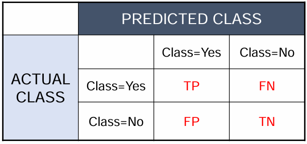
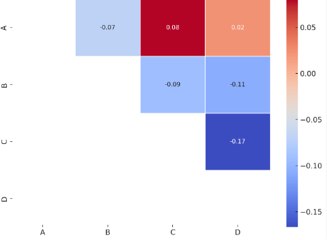

# from my code

## 노트북 선정 목적

url : https://www.kaggle.com/code/anubhavgoyal10/airline-passenger-satisfaction-knn

목적 : 이론으로 배운 **KNN의 실제 활용 사례** 학습

>### K-Nearest Neighbor 이론
>1. **아이디어** : 오리처럼 걷고, 오리처럼 울면 오리로 여기겠다. 
>
>-> **라벨이 없는 데이터에게 가장 가까운(가장 유사한) 데이터의 라벨을 부여**한다.
>
>2. *다음을 필요로 한다.*
>
>     ✔️ 라벨이 있는 데이터셋
>
>     ✔️ 두 레코드(데이터의 한 행) 간의 거리/유사도를 수치화하는 기준 및 측정방식
>
>       - 거리 메트릭 예시
>
>      | Metric      | 설명                           |
>      |-------------|--------------------------------|
>      | Euclidean   | 일반적인 직선 거리              |
>      | Manhattan   | 직각 거리 (격자 기반)           |
>      | Cosine      | 각도 기반 유사도 (방향 위주)    |
>
>
>     ✔️ 하이퍼파라미터 K : 주변 몇 개의 데이터를 기준으로 판단할지 결정 
>
>     ✔️ 새로운(라벨이 없는) 데이터를 분류할 수 있는 판단 기준
>
>3. K 값 고르기
>   - 너무 작으면 -> 노이즈에 민감, **과적합** 가능
>   - 너무 크면 -> 같은 클래스로 분류되면 안되는 데이터를 묶음(**과소적합**)
>
```
⚠️ 주의사항

데이터 변수마다 스케일(값의 범위)이 다를 경우, 거리 계산 시 특정 변수에만 과도한 영향을 줄 수 있음
=> 따라서 데이터셋에 따라 스케일링(Standardization) 필요

🔍 StandardScaler : 평균 0, 표준편차 1로 변환
🔍 MinMaxScaler : 0~1 범위로 변환
```

### K Nearest Neighbors 실제 활용
```python
knn = KNeighborsClassifier(n_neighbors=i)
score = cross_val_score(knn, X_train, y_train, cv=5, scoring = ' ')
' '.append(score.mean())
```



scoring 의 종류
| scoring 이름               | 의미                                                        |
|----------------------------|-------------------------------------------------------------|
| `accuracy`               | 정확도 (전체 정답 비율) = **(TP+TN)/(TP+FN+FP+TN)**              |
| `precision`              | 정밀도 (P로 예측한 것 중 실제 P 비율) = **TP/(TP+FP)**        |
| `recall`                 | 재현율 (실제 P 중 맞힌 비율) = **TP/(TP+FN)**                        |
| `f1`                     | F1 점수 (precision과 recall의 조화 평균) = **2/Precision+2/Recall**        |
| `roc_auc`                | ROC AUC (이진 분류 확률 기반 평가지표)                      |
| `neg_log_loss`          | 로그 손실 (작을수록 좋음, 값은 음수로 나옴)                |
| `neg_mean_squared_error`| 회귀용: 평균 제곱 오차 (작을수록 좋음, 값은 음수로 나옴)    |

*How specific the model is in not detecting fire when there is no fire*
- Type 1 error = FP Rate(1-specificity) = FP/(FP+TN)

*How sensitive the model is working in detecting fire when there is fire*
- Type 2 error = FN Rate(1-sensitivity=1-recall) = FN/(TP+FN)

---

## inplace = True
기능 : 원본 데이터에 수정사항 바로 덮어쓰기 할 수 있음

>**사용 가능**한 상황
- 원본 데이터 전체를 수정할 경우
- 원본 데이터의 한 행/열에 대해서만 수정사항 반영할 경우

>**사용 불가능**한 상황
- 원본 데이터에서 몇 개의 행/열을 뽑아 수정할 경우


# from members' code

## object vs category
| 구분         | object                            | category                                  |
|--------------|-----------------------------------|--------------------------------------------|
| 의미         | 일반적인 문자열 데이터 타입       | 범주형 데이터 전용 타입                    |
| 메모리/속도  | 메모리 많이 사용, 처리 속도 느림 | 메모리 적게 사용, 연산 속도 빠름        |
| 내부 표현    | 문자열 그대로 저장                | 정수(label)로 인코딩                      |
| 정렬/순서    | 문자열 기준 정렬                  | 순서 지정 가능 (`ordered=True`)         |
| 문자열 처리  | `.str` 메서드 등으로 자유로움 | 문자열 처리 제한적                      |
| 사용 추천 상황 | 텍스트 분석, 단어 비교 등 필요할 때 | 클래스/범주형 변수 처리, 분석/시각화 시 적합 |

---

## 상삼각행렬을 쓰는 이유
- 중복 제거
- 시각화 간소화
- 불필요한 정보 감춤(상, 하 완전히 일치하니)
- 표/리포트 작성시 효율적
```
그럼 난 히트맵 시각화할 때 상삼각 이용해서 봐야겠다~!
```
```python
# 기존상관행렬 시각화 예시
sns.heatmap(corr_matrix, mask=mask)

# 상삼각행렬 시각화 예시(low를 가려서 upper만 남기기)
mask=np.tril(np.ones_like(corr, dtype=bool))
```
