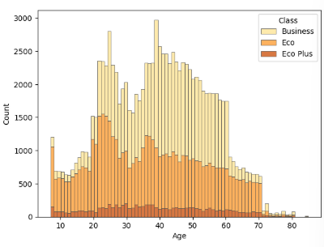
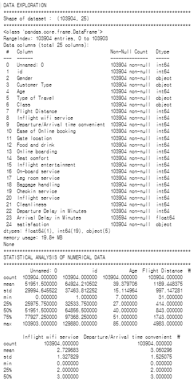
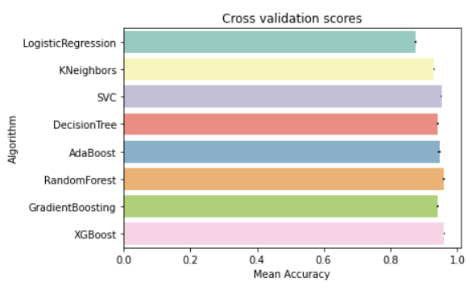

# from my code

## 노트북 선정 목적

url : https://www.kaggle.com/code/anubhavgoyal10/airline-passenger-satisfaction-knn

목적 : 이론으로 배운 **KNN의 실제 활용 사례** 학습

>### K-Nearest Neighbor 이론
>1. **아이디어** : 오리처럼 걷고, 오리처럼 울면 오리로 여기겠다. 
>
>-> **라벨이 없는 데이터에게 가장 가까운(가장 유사한) 데이터의 라벨을 부여**한다.
>
>2. *다음을 필요로 한다.*
>
>     ✔️ 라벨이 있는 데이터셋
>
>     ✔️ 두 레코드(데이터의 한 행) 간의 거리/유사도를 수치화하는 기준 및 측정방식
>
>       - 거리 메트릭 예시
>
>      | Metric      | 설명                           |
>      |-------------|--------------------------------|
>      | Euclidean   | 일반적인 직선 거리              |
>      | Manhattan   | 직각 거리 (격자 기반)           |
>      | Cosine      | 각도 기반 유사도 (방향 위주)    |
>
>
>     ✔️ 하이퍼파라미터 K : 주변 몇 개의 데이터를 기준으로 판단할지 결정 
>
>     ✔️ 새로운(라벨이 없는) 데이터를 분류할 수 있는 판단 기준
>
>3. K 값 고르기
>   - 너무 작으면 -> 노이즈에 민감, **과적합** 가능
>   - 너무 크면 -> 같은 클래스로 분류되면 안되는 데이터를 묶음(**과소적합**)
>
```
⚠️ 주의사항

데이터 변수마다 스케일(값의 범위)이 다를 경우, 거리 계산 시 특정 변수에만 과도한 영향을 줄 수 있음
=> 따라서 데이터셋에 따라 스케일링(Standardization) 필요

🔍 StandardScaler : 평균 0, 표준편차 1로 변환
🔍 MinMaxScaler : 0~1 범위로 변환
```

### K Nearest Neighbors 실제 활용
```python
knn = KNeighborsClassifier(n_neighbors=i)
score = cross_val_score(knn, X_train, y_train, cv=5, scoring = ' ')
' '.append(score.mean())
```


scoring 의 종류
| scoring 이름               | 의미                                                        |
|----------------------------|-------------------------------------------------------------|
| `accuracy`               | 정확도 (전체 정답 비율) = **(TP+TN)/(TP+FN+FP+TN)**              |
| `precision`              | 정밀도 (P로 예측한 것 중 실제 P 비율) = **TP/(TP+FP)**        |
| `recall`                 | 재현율 (실제 P 중 맞힌 비율) = **TP/(TP+FN)**                        |
| `f1`                     | F1 점수 (precision과 recall의 조화 평균) = **2/Precision+2/Recall**        |
| `roc_auc`                | ROC AUC (이진 분류 확률 기반 평가지표)                      |
| `neg_log_loss`          | 로그 손실 (작을수록 좋음, 값은 음수로 나옴)                |
| `neg_mean_squared_error`| 회귀용: 평균 제곱 오차 (작을수록 좋음, 값은 음수로 나옴)    |

*How specific the model is in not detecting fire when there is no fire*
- Type 1 error = FP Rate(1-specificity) = FP/(FP+TN)

*How sensitive the model is working in detecting fire when there is fire*
- Type 2 error = FN Rate(1-sensitivity=1-recall) = FN/(TP+FN)

---

## inplace = True
기능 : 원본 데이터에 수정사항 바로 덮어쓰기 할 수 있음

>**사용 가능**한 상황
- 원본 데이터 전체를 수정할 경우
- 원본 데이터의 한 행/열에 대해서만 수정사항 반영할 경우

>**사용 불가능**한 상황
- 원본 데이터에서 몇 개의 행/열을 뽑아 수정할 경우

---

# from members' code

## object vs category vs mapping
| 항목              | object                           | category                                | mapping (예: `.map({'A':0, ...})`)      |
|-------------------|-----------------------------------|------------------------------------------|------------------------------------------|
| 의미/용도         | 일반 문자열 타입                  | 범주형 데이터 전용 타입                  | 값을 다른 값으로 직접 치환              |
| 내부 표현         | 문자열 그대로 저장                | 정수 인코딩 + 범주 인덱스 테이블         | 치환된 값 (ex. 문자열 → 숫자)           |
| 값 변경 여부      | ❌ 그대로 유지                   | ❌ 그대로 유지                           | ✅ 값 자체 변경                           |
| 메모리 효율       | ❌ 낮음                           | ✅ 높음 (메모리 절약, 속도 빠름)         | ⚠️ 원래 타입 유지 (효율성 차이는 없음)  |
| 문자열 처리 가능  | ✅ 자유롭게 `.str.upper()` 등     | ⚠️ 일부만 가능 or 제한됨                 | ✅ 바꾼 값이 문자열이면 가능              |
| 대표 사용 목적    | 텍스트 처리, 시각화              | 범주형 인코딩, 그룹화, 분석용 최적화     | 머신러닝용 숫자 변환 등                   |
| 숫자 모델 입력용  | ❌ 비효율적                      | ✅ `.cat.codes`로 변환 가능              | ✅ 보통 숫자로 치환되므로 바로 사용 가능 |
| 순서 부여 가능    | ❌ 불가                           | ✅ `ordered=True` 가능                   | ❌ 수동으로 해줘야 함                    |
| 예시              | `'Male'`, `'Female'`              | `'Male'`, `'Female'` (내부 0/1)          | `'Male'` → `0`, `'Female'` → `1`         |

=> 값을 다루는 **유연함(자유도)** : mapping > object > category

---

## 상삼각행렬을 쓰는 이유
- 중복 제거
- 시각화 간소화
- 불필요한 정보 감춤(상, 하 완전히 일치하니)
- 표/리포트 작성시 효율적
```
그럼 난 히트맵 시각화할 때 상삼각 이용해서 봐야겠다~!
```
```python
# 기존상관행렬 시각화 예시
sns.heatmap(corr_matrix, mask=mask)

# 상삼각행렬 시각화 예시(low를 가려서 upper만 남기기)
mask=np.tril(np.ones_like(corr, dtype=bool))
```


---

## `multiple = stack` vs `stack()`

| 항목            | `multiple='stack'`                      | `stack()` 함수                               |
|-----------------|------------------------------------------|---------------------------------------------|
| 속한 라이브러리 | `seaborn.histplot()` 옵션               | `pandas.DataFrame` 메서드                   |
| 역할            | 그룹별 막대를 **위로 쌓아 히스토그램 표현** | 열을 인덱스로 쌓아 **DataFrame → Series 변환** |
| 시각화 관련?    | 그래프에 사용됨                       | 데이터 구조 변경용                        |
| 용도       | **그래프 막대 누적**                    | **테이블 구조 변경**                         |

### `multiple = stack` 활용 예시
```python
sns.histplot(data, x = 'Age', hue = 'Class', multiple = 'stack', palette = 'YlOrBr', edgecolor = '.3', linewidth  = .5, ax = ax[1])
```


---

## One-Hot Encoding
- 범주형 변수를 수치형 벡터로 변환하는 인코딩 방식
- 장점 : ML에서 범주형 데이터를 숫자로 변환 가능, 순서/우열 정보가 없는 범주형 데이터 처리에 적합
- 단점 : 칼럼 수의 증가(고차원)

| 구분           | 이진 범주형 변수                            | 다중 범주형 변수                             |
|----------------|---------------------------------------------|----------------------------------------------|
| 고유값 개수    | 2개                                          | 3개 이상                                     |
| 기본 인코딩    | 하나의 열로 `0` 또는 `1`로 처리 가능       | 숫자로 인코딩하면 서열 오해 위험 있음      |
| 처리 방법      | `LabelEncoder` 또는 `astype('category')`     | `pd.get_dummies()` 또는 `OneHotEncoder()`    |
| 원핫 인코딩 필요 여부 | 보통 필요 없음                         | 필요함                                    |
| 예측 모델 입력 시 | 바로 입력 가능                             | 원핫 벡터로 변환 후 입력 필요                |

---

## 사용자 정의 함수 활용
`def` 를 이용해 함수를 정의할 수 있는데, 이를 통해 data exploration을 한번에 해주는 함수도 정의할 수 있음
```python
def data_explore(df):
    print("DATA EXPLORATION")
    print("*" * 70)
    print("Shape of dataset : ", df.shape)
    print("*" * 70)
    print(df.info())
    print("*" * 70)
    print("STATISTICAL ANALYSIS OF NUMERICAL DATA")
    print("*" * 70)
    print(df.describe())
    print("*" * 70)
    print("STATISTICAL ANALYSIS OF CATEGORICAL DATA")
    print("*" * 70)
    print(df.describe(include='object'))
    print("*" * 70)
    print("MISSING VALUES")
    print("*" * 70)
    print(df.isnull().sum())
    print("*" * 70)
    print("MISSING VALUES IN %")
    print("*" * 70)
    print(df.isnull().mean() * 100)
    print("*" * 70)

```
### 결과 예시



```
한 번에 비교하기 편할듯 하다! 나도 써먹어야지
```

---

## xerr
```python
sns.barplot("CorssValMeans","Algorithm", data=cv_res, palette="Set3", orient="h", **{'xerr':cv_std})
```
xerr 의 기능 : 막대에 오차막대 포함

### 그래프 예시



- 막대 그래프 끝 검은 부분이 오차 범위 표시한 것임

---

# 한줄 다짐
```
코드에 집중하는 것도 좋지만 전반적인 흐름도 이해하고 의문을 가지면서 할 것!
이번 분석에는 데이터 셋의 설명 먼저 본 후 필사를 시작하자...
```