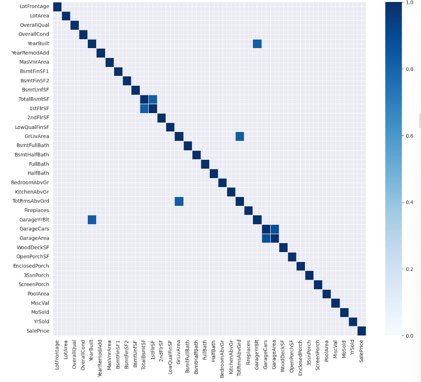

# from my code

## 일반칼럼(df[...]) vs df.loc[...] vs df.iloc[...]

|비교항목|일반칼럼|df.loc|df.iloc|
|---|---|---|---|
|기본용도|조건 필터링 중심|**레이블** 기반 인덱싱|**정수** 기반 인덱싱|
|행 접근 예시|`df[df['id'] == 3]` | `df.loc[3]` | `df.iloc[3]` |
|열 접근 예시|`df[col]`|`df.loc[:, 'col']`|`df.iloc[:, 2]`|
|인덱스 타입|컬럼 조건 기반|**index 이름**(id는 id 번호)|**순서 번호**(고유번호 상관없이 몇번째 행/열인지)|
|멀티 인덱스 지원|❌ | ✅ | ✅ |
|활용 목적|조건으로 필터링할 때|명시적 인덱스 접근|위치 기반 빠른 접근|

---

## append() vs extend() vs 리스트 내포

💡.append() : 리스트에 값을 **하나씩** 추가할 때 쓰는 함수
```python
cont_num_var = []
for i in numeric_train_columns:
    if i not in disc_num_var:
        cont_num_var.append()
```
💡.extend() : 리스트에 **여러 개 한꺼번에** 추가할 때 사용하는 함수 
```python
cont_num_var = []
cont_num_var.extend([i for i in numeric_train.columns if i not in disc_num_var])
```
💡리스트 내포 
```python
cont_num_var = [i for i in numeric_train.columns if i not in disc_num_var]
```

### ❓그럼 왜 보통 append를 쓰나?
- 더 직관적(구조가 한 눈에 보임)
- 복잡한 조건이나 여러 줄 처리할 때는 오히려 리스트 내포가 불편

---

## 상관관계 제한해서 상관행렬 히트맵 시각화 -> 다중공산성 발견에 용이
```python
correlation = numeric_train.corr()
sns.heatmap(correlation, mask=correlation<0.8, linewidth=0.5, vmin=0, vmax=1.0, cmap='Blues')
```
- `mask = correlation < 0.8` : 상관관계가 80% 미만인 부분은 가려줘
- `linewidth=0.5`, `cmap='Blues'` : 히트맵 그래프 설정
- `vmin=0, vmax=1.0` : 색 진하기는 0.0~1.0 폭으로 유지(default:0.8~1.0 -> 0.8이 넘는 것들도 너무 연해서 0.8 미만의 색과 크게 구분되지 않음)

### 그래프 예시


---

## 산점도(상관관계) + 회귀선(regression line) 시각화
```python
sns.regplot(x=numeric_train['MoSold'], y='SalePrice', data=numeric_train, ax=axes[0], line_kws={'color':'black'})
```
- 회귀선 : 상관관계를 요약한 **최소제곱 회귀선(linear regression)**
- `ax=axes[0]` : 첫 번째 서브플롯(`axes[0]`)에 검정색 회귀선 그려줌
- 💡`fit_reg=True` 를 이용하여 선형 회귀선 추가하기도 함함

### 그래프 예시


- 범주형 변수와 타겟변수 간 상관관계 시각화여서 산점도 경계가 뚜렷이 구분되어 있음
- 두 변수의 상관관계가 매우 낮기 때문에 회귀선이 x축과 평행

❓만약 상관관계가 높은 경우?


- 연속형 변수 간 상관관계 시각화여서 산점도가 고르게 퍼져있음
- 두 변수는 양의 상관관계를 가짐

---

## StandardScaler vs MinMaxScaler vs RobustScaler