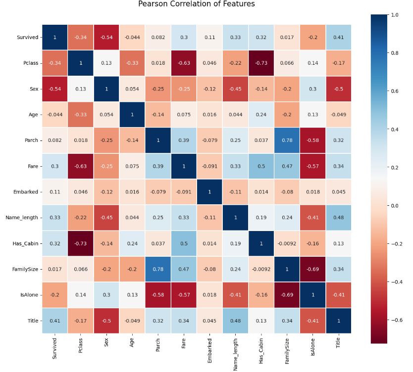
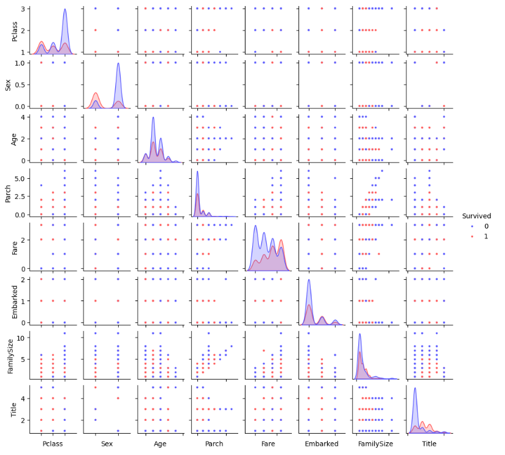

# from my code

**변수 간 상관관계 파악**

>
>
> 너다나비 할 때 깨달은 점인데, 여태까지는 열이 많은 데이터셋을 많이 다루어보지 않아서 변수간 상관관계를 한 눈에 파악할 수 있는 히트맵을 잘 사용하지 않았다. 그런데, 최근 변수가 많은 데이터셋을 많이 접하게 되면서 히트맵의 중요성을 알게 되었다.

**seaborn.plot을 통한 변수 간 관계 시각화**

<pre><code class="language-python">
g = sns.pairplot(train[[u'Survived', u'Pclass', u'Sex', u'Age', u'Parch', u'Fare', u'Embarked',
       u'FamilySize', u'Title']], hue='Survived', palette = 'seismic',size=1.2,diag_kind = 'kde',diag_kws=dict(shade=True),plot_kws=dict(s=10) )
g.set(xticklabels=[])
</code></pre>

> 1 pairplot() : 여러 수치형 변수 간 산점도, 분포도, 관계 시각화
>
> 2 hue = 변수명 : 생존 여부에 따라 색 구분
>
> 3 diag_king = 'kde' : diag_king(대각선 diagnol kind을 뜻하고, kde는 변수 밀도곡선을 의미) -> 대각선에는 밀도 추정 곡선 표시한다는 것
>
> 4 palette = 'seismic' : 생존/사망 색상을 seismic 컬러맵으로 설정
>
> 5 plot_kws=dict(s=10) : 산점도의 점 크기 조절
>
> 6 g.set(xticklabels=[]) x축 눈금 제거(깔끔하게 보이기 위해)
>
>